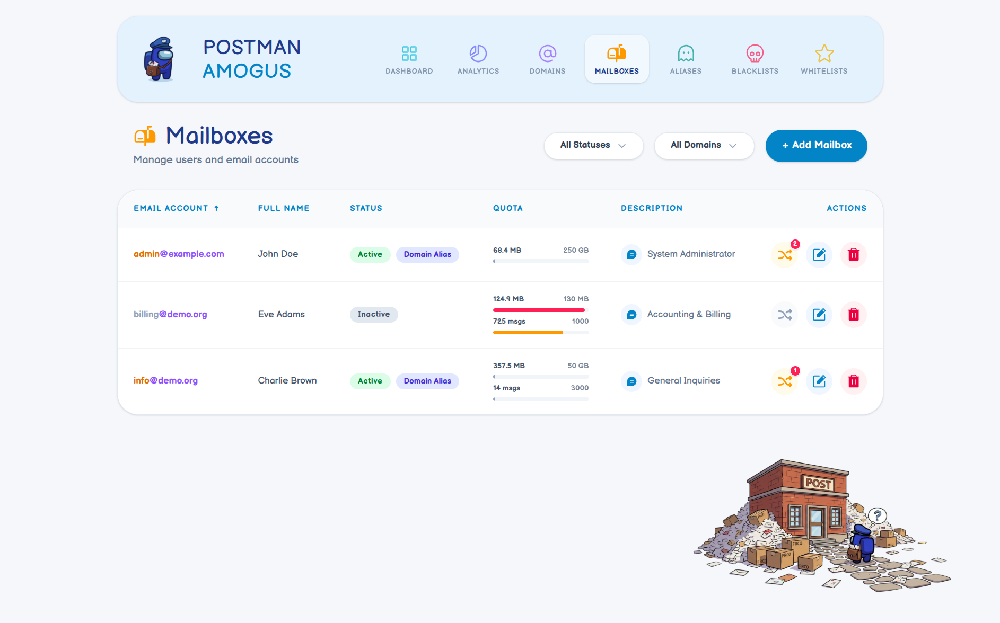

# Postman Amogus


 

Postman Amogus is an administration panel for orchestrating Exim and Dovecot environments. It leverages a custom MariaDB schema and a SvelteKit frontend for a seamless experience. 

And yes, the UI design is a joke. It features a fun "Amogus" theme just for the laughs. Very *sus*. ඞ

## Background & Acknowledgments

This project is an alternative to classic mail panels like PostfixAdmin.

*Disclaimer: The "Amogus" theme, characters, and related memes are inspired by the game "Among Us", which is the property of Innersloth LLC. This is a non-commercial, open-source parody project and is not affiliated with, endorsed, or sponsored by Innersloth.*

**Author's Note:**
> *"Legacy mail administration tools are often bloated and outdated. I decided to bring essential mail server management into the modern web era with a custom database structure and a fresh interface, heavily seasoned with internet culture."*

Built entirely using the **vibe coding** approach, powered by the **Gemini 3.1 Pro** AI model.

## Table of Contents
- [Key Features](#key-features)
- [Architecture Overview](#architecture-overview)
- [Authentication](#authentication)
- [Development](#development)
  - [Running Locally](#running-locally)
  - [Database Options (Mock Data)](#database-options-mock-data)
  - [Running Tests](#running-tests)
- [Production Build & Deployment](#production-build--deployment)
- [Environment Variables Configuration](#environment-variables-configuration)
- [License](#license)

## Key Features

- **Modern & Responsive UI**: A beautiful dashboard built with SvelteKit and Tailwind CSS, fully supporting a mobile-first administration experience.
- **Custom Schema**: A specialized MariaDB database structure built for routing lookups.
- **Advanced Mail Management**: Effortlessly create and manage Domains, Mailboxes, and Aliases.
- **Rich Analytics Dashboard**: Deep dive into your server data with real-time statistical overviews, storage usage charts, and visual mail routing graphs.
- **Security & Routing**: Native support for Global Blacklists and Whitelists (compatible with Rspamd), DKIM enforcement, and Global DNSBL configuration.
- **Lightning-Fast Global Search**: Case-insensitive, fuzzy search across all your entities and their descriptions.

## Architecture Overview

Postman Amogus is built with a modern tech stack focused on speed, maintainability, and developer experience:

- **Frontend Framework**: [SvelteKit 5](https://svelte.dev/) (using the new `runes` reactivity model).
- **Styling**: Tailwind CSS v4 for utility-first responsive design.
- **State Management**: Reactive Svelte stores (e.g., `persistedStore.svelte.ts`) synced with `localStorage`.
- **Testing**: Comprehensive unit testing powered by [Vitest](https://vitest.dev/) and `jsdom`.
- **Database**: MariaDB with a custom schema specifically optimized for Postfix/Exim lookups.

The application strictly separates presentation components (in `src/lib/components/ui/`) from business logic and utilities (`src/lib/utils/`), ensuring a scalable codebase.

## Authentication

By design, Postman Amogus has no built-in login system. For production, deploy it behind a reverse proxy (NGINX, Traefik, Caddy) and enforce access control at the web server level using **HTTP Basic Authentication** or an identity provider like **Authelia**. This keeps the application lightweight and delegates security to purpose-built tools.

## Development

The project uses a containerized development environment.

### Running Locally

The fastest way to start the development environment is via Docker Compose:

1. Create your environment variables file by copying the development example:
   ```bash
   cp .env.dev.example .env
   ```
2. Start the development containers:
   ```bash
   docker compose -f docker-compose.dev.yaml up --build -d
   ```
   *(Note: The Node.js container will automatically run `npm install` on its first boot, which might take a minute).*
To stop the environment:
```bash
docker compose -f docker-compose.dev.yaml down
```

- **Frontend App:** Available at `http://localhost:8473`
- **Database Admin (phpMyAdmin):** Available at `http://localhost:8474`

### Database Options (Mock Data)

The repository includes two ready-to-use SQL files for database initialization:
- `mail_nodata.sql`: A completely **empty database structure** ready for fresh setups *(default)*.
- `mail_mocked.sql`: A database pre-filled with **mock data**, perfect for testing the UI and analytics.

*Note: The mock database includes tables with the `analytics_` prefix. These tables are completely optional and are only utilized if you have an external statistics collector running alongside your mail server. If they are absent, the Analytics tab will simply hide itself.*

**To use the mock data**, simply edit `docker-compose.dev.yaml` and change `./mail_nodata.sql` to `./mail_mocked.sql` in the `mariadb` volumes section before starting the container.

### Running Tests

We use Vitest for unit testing. To run tests and generate a coverage report:

```bash
docker compose -f docker-compose.dev.yaml exec app npm run test:coverage
```
This automatically updates the coverage badge in this README!

## Production Build & Deployment

For production environments, the application is deployed as a Docker container. The production `docker-compose.yaml` securely builds the application image and runs the Node.js server.

1. Ensure you have a running MySQL/MariaDB database initialized with `mail_nodata.sql`.
2. Create your environment variables file by copying the production example and properly configuring your production database credentials:
   ```bash
   cp .env.prod.example .env
   ```
3. Build and start the production container:
   ```bash
   docker compose -f docker-compose.yaml up --build -d
   ```
4. The application will be available on the port specified by `HOST_APP_PORT` (default 8473).

## Environment Variables Configuration

The application uses an `.env` file for configuration. Below is a detailed description of the available variables:

### Database Settings
* `DB_HOST`: The IP address or hostname of your MariaDB database (e.g., `127.0.0.1` or `postman_amogus_db` in Docker).
* `DB_PORT`: The port your database is listening on (usually `3306`).
* `DB_USER`: The MySQL username with permissions to read/write the mail database.
* `DB_PASSWORD`: The password for the database user.
* `DB_NAME`: The name of the mail database (e.g., `mail`).

### Docker Environment Settings (docker-compose.dev.yaml)
* `HOST_APP_PORT`: The port exposed on the host for the SvelteKit app (default `8473`).
* `HOST_PMA_PORT`: The port exposed on the host for phpMyAdmin (default `8474`).
* `DB_ROOT_PASSWORD`: The root password for the MariaDB container initialization.

## License

This project is licensed under the **GNU Affero General Public License v3.0 (AGPLv3)** - see the [LICENSE](LICENSE) file for details.

This ensures that the project remains open-source. Any derivative works or modifications to this software (even if provided as a service over a network) must also be open-sourced and distributed under the same terms, preserving the original author's attribution.
